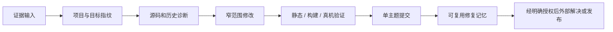

# Codex Engineering Workflow Kit

一套面向真实软件交付的 Codex 工作流模板，把项目约束、专业 Skill、Obsidian 工程记忆、隐私检查和分层验证组合成可安装、可审查的工具包。

> [!IMPORTANT]
> 这是由个人维护的自定义工作流仓库，不是 OpenAI 官方发行版，也不代表 OpenAI 的产品承诺。Codex 的 `AGENTS.md`、Skills 和 MCP 能力以官方文档为准。

## 它解决什么问题

这个仓库主要处理三个工程问题：

- 让 Codex 在进入项目时先读取明确的工作约束，而不是每次重新解释协作规则。
- 把 Bug 调查、跨分支移植、构建验证、记忆维护等高风险流程固化为可复用 Skill。
- 把“代码改了”与“静态检查通过、构建通过、真机通过、平台通过”分开记录，避免把不完整证据描述成已经交付。

它不会替你保存账号、客户资料、设备密钥、内部服务地址或真实项目映射。

## 工作流概览



完整的阶段、决策点和授权边界见 [工程工作流](docs/workflow.md)。一个使用合成标识整理的端到端案例见 [低电量重启 UI 状态竞争案例](docs/case-study-watch-restart-demo.md)。

## 五分钟开始

需要 Git、Python 3.10+ 和已经可用的 Codex。Obsidian 与 Everything Search MCP 都是可选项。

### Windows

```powershell
git clone https://github.com/xialangji-debug/codex-skills-agentmd-obsidian.git
cd codex-skills-agentmd-obsidian
python -X utf8 .\scripts\run_public_checks.py
powershell -ExecutionPolicy Bypass -File .\scripts\install.ps1
```

脚本默认安装到：

```text
%USERPROFILE%\.codex\skills
%USERPROFILE%\.codex\skills-index
%USERPROFILE%\.codex\AGENTS.md
%USERPROFILE%\Documents\Obsidian\CodexVault\Codex
```

只安装 Skills 和索引：

```powershell
powershell -ExecutionPolicy Bypass -File .\scripts\install.ps1 `
  -SkipAgents -SkipObsidian -SkipMcp -SkipObsidianInstall
```

自定义安装目录：

```powershell
powershell -ExecutionPolicy Bypass -File .\scripts\install.ps1 `
  -CodexHome "D:\Tools\codex" `
  -VaultPath "D:\Obsidian\CodexVault" `
  -SkipObsidianInstall
```

### macOS / Linux

```bash
git clone https://github.com/xialangji-debug/codex-skills-agentmd-obsidian.git
cd codex-skills-agentmd-obsidian
python3 scripts/run_public_checks.py
bash scripts/install.sh
```

macOS / Linux 安装脚本不会安装 Obsidian，且默认不复制 MCP 元数据。路径和组件可以通过环境变量调整：

```bash
CODEX_HOME="$HOME/.codex" \
OBSIDIAN_VAULT="$HOME/Documents/Obsidian/CodexVault" \
INSTALL_MCP=0 \
bash scripts/install.sh
```

安装后重新打开 Codex，让新的 Skills 和 `AGENTS.md` 生效。

## Codex 提供什么，本仓库增加什么

Codex 原生扩展点：

- [`AGENTS.md`](https://learn.chatgpt.com/docs/agent-configuration/agents-md)：向 Codex 提供全局或项目级协作指令。
- [Skills](https://learn.chatgpt.com/docs/build-skills)：把专业知识、步骤和脚本组织成按需加载的能力包。
- [MCP](https://learn.chatgpt.com/docs/extend/mcp)：连接外部工具和数据源。

本仓库在这些扩展点之上增加：

- 嵌入式项目的 Bug 证据、源码调查、修复、验证和收尾规则。
- 一行式主索引与按领域加载的 Skill 索引。
- Obsidian 工程记忆模板和“一种根因一份规范笔记”的目标记录模型。
- Windows/macOS/Linux 安装脚本。
- 不回显敏感命中值的隐私扫描器和离线检查入口。

## 仓库内容

```text
.
|-- AGENTS.md                         # 可安装的全局协作规则
|-- skills/                           # 15 个公开复用的自定义 Skill
|-- skills-index/                     # 主索引和领域索引
|-- obsidian/Codex/                   # 空的工作记忆模板
|-- mcp/everything-search/            # 公开元数据与配置示例
|-- docs/                             # 工作流与脱敏案例
|-- public-sync-manifest.json         # 自动同步的显式公开白名单
|-- scripts/install.ps1               # Windows 安装入口
|-- scripts/install.sh                # macOS/Linux 安装入口
|-- scripts/privacy_scan.py           # 当前树、暂存区和历史隐私检查
|-- scripts/sync_public_snapshot.py   # 候选树构建与确定性同步
`-- scripts/run_public_checks.py      # 离线测试与安装烟测
```

<details>
<summary>当前公开 Skills</summary>

<!-- BEGIN PUBLIC SKILLS -->
`aa-skill-router`, `asr3601-cross-branch-porting`, `asr3601-fix-closeout-reporter`, `asr3601-lvgl-firmware-triage`, `asr3601-project-onboard`, `asr3601-protocol-branch-matrix`, `asr3602-local-build-flash`, `asr360x-bug-delivery-orchestrator`, `catstudio-log-extractor`, `codex-ccswitch-mobile`, `codex-clash-proxy`, `obsidian-fix-pattern-memory`, `skill-usage-tracker`, `zentao-bug-resolver`, `zentao-bug-triage`。
<!-- END PUBLIC SKILLS -->

</details>

<details>
<summary>当前公开 MCP 元数据</summary>

<!-- BEGIN PUBLIC MCP -->
`everything-search`。
<!-- END PUBLIC MCP -->

</details>

每周公开同步的白名单、候选树和 PR 边界见 [公开快照同步](docs/public-sync.md)。

## 验证边界

本仓库要求明确区分以下证据，后一级不能由前一级自动推导：

1. `static_checked`：语法、静态契约或差异检查通过。
2. `build_verified`：目标构建确实成功。
3. `device_verified`：匹配固件和设备的真实场景通过。
4. `platform_verified`：服务器、应用或外部平台行为得到验证。
5. `qa_closed`：测试方完成最终验收并关闭问题。

外部 Bug 状态修改、刷机、上传和发布都必须由用户明确授权；安装这个仓库不会自动执行这些动作。

## 隐私门禁

仓库仅分发可复用配置、Skill、空模板和合成示例。不要提交私人笔记、聊天原文、客户源码、真实项目映射、Bug 系统数据、内部地址、账号凭据、设备密钥、固件包或日志。

检查当前工作树：

```powershell
python -X utf8 .\scripts\privacy_scan.py --root .
```

检查暂存内容：

```powershell
python -X utf8 .\scripts\privacy_scan.py --root . --staged
```

检查全部可达 Git 历史：

```powershell
python -X utf8 .\scripts\privacy_scan.py --root . --history
```

本机专有关键词写入被 Git 忽略的 `.privacy-denylist.local.txt`，格式参考 `.privacy-denylist.example.txt`：

```text
customer-name<TAB>literal value
```

扫描报告只显示规则、文件、行号和历史提交短标识，不回显命中的私密文本。安全问题的报告方式见 [SECURITY.md](SECURITY.md)，提交规则见 [CONTRIBUTING.md](CONTRIBUTING.md)。

## 版本与维护

- 当前公开基线：`v1.0.0`
- 变更摘要：[CHANGELOG.md](CHANGELOG.md)
- License：[MIT](LICENSE)

Maintainer：xiakezhen

需求、规则、风险决策和最终验证：xiakezhen

代码与文档辅助：OpenAI Codex
