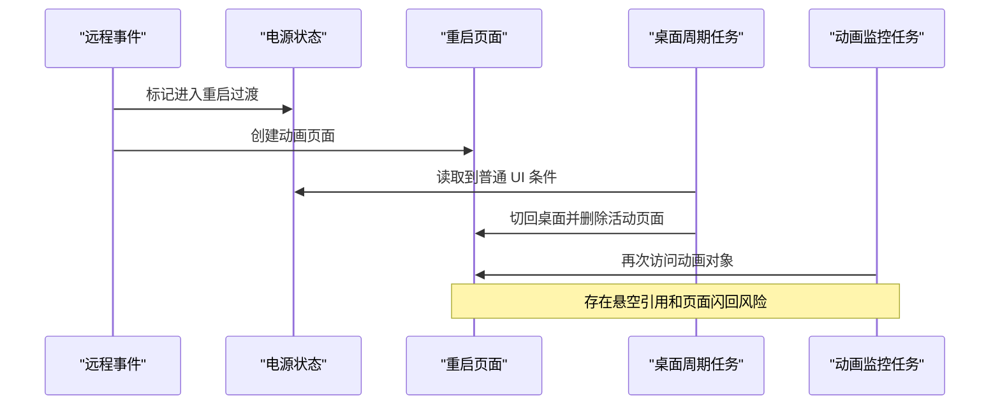

# 合成案例：低电量重启期间的 UI 状态竞争

> 本文保留一个真实工程问题的调查结构，但仓库名、Bug 编号、分支、版本、设备、源码路径、符号和界面文字全部是合成标识。本文不包含客户源码、外部工单内容、内部地址或真实设备数据。

## 问题摘要

- 演示工单：`BUG-DEMO-001`
- 演示仓库：`watch-firmware-demo`
- 演示分支：`demo/release`
- 演示版本：`DEMO-1.0`
- 现象：设备处于低电量状态时触发远程重启，重启动画偶尔短暂返回桌面；部分路径还可能继续访问已经销毁的动画对象。

期望行为是：进入重启流程后，普通桌面刷新不再改变活动页面；监控任务先停止，再删除重启页面；系统只发送一次重启请求。

## 证据链

调查时分别确认了三条事实：

1. 重启事件和桌面周期刷新运行在不同的异步路径。
2. 桌面刷新在电源过渡期间仍允许切换活动页面。
3. 页面删除发生在动画监控任务结束之前，任务仍持有旧对象引用。

相似修复记忆只用于提示“检查异步 UI 所有权与销毁顺序”；是否能直接采用仍由当前源码和调用链决定。

## 根因

根因不是动画资源本身，而是两个生命周期约束缺失：

- 电源进入不可逆过渡后，普通 UI 周期任务没有停止导航。
- 重启页面销毁不是幂等流程，后台监控任务和 UI 对象的释放顺序不固定。

因此，同一个症状同时具有“错误页面切换”和“释放后继续访问”的风险。

## 窄修复

演示修改限制在三个职责边界：

- `system/power_state.c`：提供只读的过渡状态，进入重启后不再恢复普通 UI 就绪态。
- `ui/launcher.c`：导航前检查 UI 就绪态，重启过渡期间不切回桌面。
- `ui/restart_view.c`：销毁入口保持幂等，先停止监控任务并清空引用，再删除动画对象；重启命令只允许发送一次。

这个方案不改变普通电量下的桌面刷新频率，也不扩大到无关的电源策略。

## 验证记录

| 层级 | 结果 | 证据边界 |
| --- | --- | --- |
| 目标 diff | 通过 | 只包含电源状态门控和重启页面生命周期修改 |
| 静态检查 | 通过 | 销毁顺序、空指针保护和单次派发约束可检查 |
| 目标构建 | 通过 | 演示目标能够完成构建 |
| 真机回归 | 待验证 | 仍需低电量、远程重启、动画结束前后和重复事件矩阵 |
| 平台验证 | 不适用 | 本案例不声明服务端行为变化 |

在没有可回溯的匹配设备证据时，案例明确保留“待验证”，不把构建结果升级为真机通过。

## 人与 Codex 的职责

- 维护者负责问题定义、风险边界、真实设备证据、是否接受修复以及最终发布决定。
- Codex 协助整理证据、搜索源码和历史、生成窄差异、运行可用检查并起草记录。
- 外部工单解决、刷机和发布仍需维护者明确授权。
