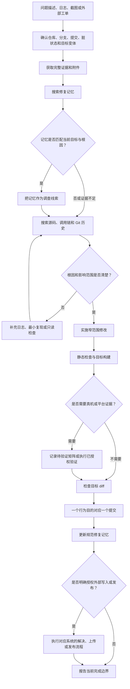

# 工程工作流

这套流程用于需要证据、目标身份、分层验证和显式授权的软件交付。它尤其适合嵌入式项目，但不依赖某个客户、设备或 Bug 系统。

## 全流程

## 阶段契约

### 1. 证据输入

先区分可见事实、用户描述和推断。截图只能证明截图中直接可见的状态；日志只能证明对应时间段；一个相似修复记录不能证明当前代码仍有相同根因。

### 2. 目标指纹

任何依赖动态目标身份的操作都要先确认仓库、分支、提交、工作树状态、产品或变体、版本和构建入口。脏工作树中的无关用户改动必须保留。

### 3. 记忆匹配

修复记忆用于缩短搜索路径，不是自动修复许可。匹配后仍需核对当前源代码、Git 历史、目标差异和已有本地修改。

### 4. 根因与修改

修改前要能说明：问题是否存在、触发链路、根因、最小修复位置、影响范围和回归风险。一个直接修复应尽可能限制在当前项目和少量文件内。

### 5. 分层验证

- `static_checked`：差异、语法、静态契约或单元测试通过。
- `build_verified`：目标工程构建成功，产物身份可确认。
- `device_verified`：匹配产物已经在匹配设备上覆盖真实场景。
- `platform_verified`：依赖服务端、应用或平台的行为得到独立证明。
- `qa_closed`：测试方完成最终验收。

构建成功不能自动写成真机通过；设备启动也不能自动证明完整计时、交互或平台矩阵通过。

### 6. 提交与记忆

每个行为变化使用一个可独立解释和回滚的提交。验证完成后，把可复用根因、关键文件、修复方式、目标记录、证据等级和注意事项更新到规范修复记忆。

### 7. 外部动作

修改 Bug 状态、切换分支、刷机、上传固件、创建 Release 和发布版本都属于单独授权的动作。调查或本地修复本身不隐含这些权限。

## 失败处理

- 目标身份冲突：停止写入，重新确认目标。
- 证据不足：报告已确认与未确认内容，不补写结论。
- 构建工具缺失：保留静态结果，将构建和真机项明确标记为待验证。
- 隐私检查失败：不提交、不推送；先移除内容并判断是否需要轮换凭据和重写历史。
- 远端 SHA 改变：停止强推，重新抓取并审查远端变化。
